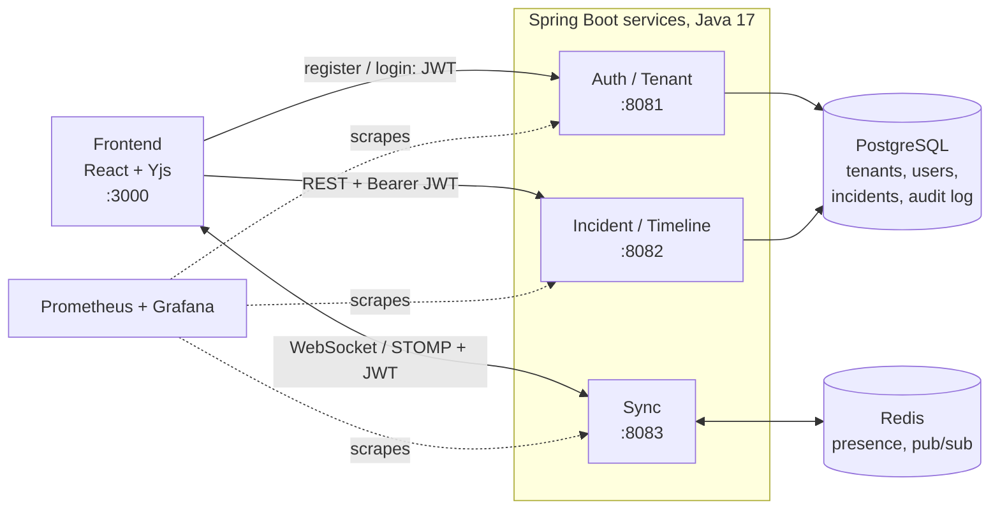
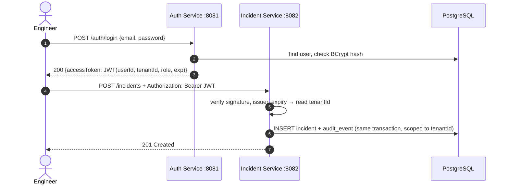

<div align="center">

# 🪢 Tether

**Real-time collaborative incident response, built to stay up while everything else is down.**

[](https://github.com/SARANGSSP/Tether/actions/workflows/auth-service.yml)


[Why](#-why-tether) · [Features](#-features) · [Architecture](#-architecture) · [Quick start](#-quick-start) · [Services](#-services) · [Roadmap](#-roadmap)

</div>

---

Tether lets several engineers (SRE, backend, DBA…) work on **the same live production incident at the same time**. They can add notes, update status, assign owners and paste logs without overwriting each other's changes or losing work when a connection drops.

## 💡 Why Tether

During an outage, teams fall back to a Slack thread or a shared doc. Neither is built for it:

| | Slack thread | Shared doc | **Tether** |
|---|:---:|:---:|:---:|
| Structured incident timeline | ❌ | ❌ | ✅ |
| Concurrent edits merge without conflicts | — | ⚠️ | ✅ CRDTs |
| Keeps working offline, merges on reconnect | ❌ | ❌ | ✅ |
| See who else is on the incident | ❌ | ⚠️ | ✅ live presence |
| Tamper-proof audit trail for the postmortem | ❌ | ❌ | ✅ append-only log |
| Monitors its own health | ❌ | ❌ | ✅ Prometheus + Grafana |

The incident tool must never become the next point of failure, so Tether is horizontally scalable, self-observable and resilient to flaky networks.

## ✨ Features

| Feature | What it means | Status |
|---|---|:---:|
| 🔐 **Multi-tenant auth** | Sign up, log in, get a JWT. Every user belongs to one organization, and an organization never sees another's data. | ✅ Live |
| 📋 **Incident management** | Create incidents and update status, severity and owner, all scoped to your organization. | ✅ Live |
| 🧾 **Append-only audit trail** | Every change is recorded in order (who, what, old → new, when). The database itself rejects edits or deletes. | ✅ Live |
| 🛡️ **Brute-force protection** | Failed logins and join-code guesses are rate limited (HTTP 429). | ✅ Live |
| ✍️ **Conflict-free collaborative timeline** | Many responders edit the same timeline at once, and concurrent edits merge automatically (Yjs CRDT). | 🟡 Works with the dev sync server |
| 📴 **Offline resilience** | Edits made while disconnected are kept locally and merge cleanly on reconnect. | 🟡 Works with the dev sync server |
| 👥 **Live presence** | See who is viewing or editing an incident right now. | 🟡 Works with the dev sync server |
| 📈 **Self-observability** | Sync latency, active sessions and reconnect success rate on Grafana dashboards. | 🟡 Auth metrics live |

## 🏗 Architecture



### How a request is authenticated

The Auth Service issues a signed JWT, and every other service verifies it on its own, using the shared `JWT_SECRET` and without calling Auth back. Tenant and user come **only** from the verified token, never from request headers.



## 🚀 Quick start

**Prerequisites:** Java 17, Node 18+, Docker (for local Postgres/Redis).

```bash
# 1. Clone and start local infrastructure
git clone https://github.com/SARANGSSP/Tether.git
cd Tether
docker compose up -d postgres redis

# 2. Start the services, each in its own terminal
cd auth-service && ./mvnw spring-boot:run        # http://localhost:8081
cd incident-service && ./mvnw spring-boot:run    # http://localhost:8082

# 3. Start the frontend and the dev Sync Service
cd frontend && npm install && npm run dev:sync   # ws://localhost:8083 (stand-in until sync-service lands)
cd frontend && npm run dev                       # http://localhost:3000
```

Open **http://localhost:3000**, create an account, and declare an incident. Open a second tab, join with the code shown in the header, and both tabs share live notes and presence. The full 3-minute demo script is in [frontend/README.md](frontend/README.md#demo-script-two-responders-about-3-minutes).

Both services ship with the same **dev-only** JWT secret, so they work together locally with no setup. For anything shared, set `JWT_SECRET` (see [Configuration](#-configuration)).

### Try it in 30 seconds

```bash
# Sign up. This creates the "Acme" organization and logs you in.
TOKEN=$(curl -s -X POST localhost:8081/auth/register -H 'Content-Type: application/json' \
  -d '{"email":"alice@acme.test","password":"correct-horse","displayName":"Alice","organizationName":"Acme"}' \
  | sed -E 's/.*"accessToken":"([^"]+)".*/\1/')

# Open an incident as Alice, in Acme
curl -s -X POST localhost:8082/incidents -H "Authorization: Bearer $TOKEN" -H 'Content-Type: application/json' \
  -d '{"title":"Checkout API 500s","severity":"SEV2"}'

# See Acme's incidents
curl -s localhost:8082/incidents -H "Authorization: Bearer $TOKEN"
```

> 💡 Prefer exploring the APIs directly? Open **http://localhost:8081/swagger-ui.html**, or import the Postman collections in `auth-service/postman/` and `incident-service/postman/`.

## 🧩 Services

| Service | Port | What it owns | Status | Docs |
|---|:---:|---|:---:|---|
| 🔐 **Auth / Tenant** | 8081 | Signup, login, JWT issuing, organizations, join codes, members (FR6) | ✅ Working | [README](auth-service/README.md) |
| 📋 **Incident / Timeline** | 8082 | Incident CRUD, status/severity/owner, append-only audit log (FR1, FR5, FR7) | ✅ Working | [README](incident-service/README.md) |
| 🔄 **Sync** | 8083 | WebSocket, Yjs document sync, presence via Redis (FR2–FR4) | ✅ Working | [README](sync-service/README.md) |
| 🖥️ **Frontend** | 3000 | Login, incident list, live incident room: shared notes, presence, offline mode | ✅ Working | [README](frontend/README.md) |

Shared infrastructure (Supabase Postgres, Upstash Redis) is described in [service-config.md](service-config.md).

## ⚙️ Configuration

Copy `.env.example` to `.env` and fill it in. Never commit `.env`.

| Variable | Used by | Default | Notes |
|---|---|---|---|
| `DB_URL` / `DB_USER` / `DB_PASSWORD` | auth, incident | local `incidentsync` DB | Point at the shared Supabase instance |
| `JWT_SECRET` | auth, incident, sync | dev-only value | **Must be identical in every service.** At least 32 bytes, e.g. `openssl rand -base64 48` |
| `JWT_ISSUER` | auth, incident, sync | `tether-auth` | |
| `JWT_TTL` | auth | `PT1H` | Token lifetime (ISO-8601 duration) |
| `CORS_ALLOWED_ORIGINS` | auth, incident, sync | `localhost:3000`, `localhost:5173` | Frontend origins |
| `REDIS_HOST` / `REDIS_PORT` / `REDIS_URL` | sync | `localhost:6379` | Upstash or local Redis Pub/Sub |

## 🛠 Tech stack

| Layer | Technology |
|---|---|
| Frontend | React, Yjs (CRDT), WebSocket client, Tailwind CSS |
| Backend | Spring Boot 3 (Java 17): Auth, Incident/Timeline and Sync services |
| Real-time | WebSocket / STOMP, Redis Pub/Sub |
| Data | PostgreSQL with Flyway migrations (durable state + append-only audit log), Redis (ephemeral presence) |
| Security | JWT (HS256) via Spring Security, BCrypt password hashing, per-tenant data isolation |
| Cloud | Docker, AWS ECS/EKS, Application Load Balancer, Terraform |
| Observability | Micrometer → Prometheus → Grafana |
| CI/CD | GitHub Actions |

## 📁 Repository layout

```
Tether/
├── auth-service/           # 🔐 Auth / Tenant service (Spring Boot, :8081)
├── incident-service/       # 📋 Incident / Timeline service (Spring Boot, :8082)
├── sync-service/           # 🔄 Real-time Sync & Presence service (Spring Boot, :8083)
├── frontend/               # 🖥️ React + Yjs incident room (:3000) and the dev Sync Service
├── .github/workflows/      # CI pipelines
├── docker-compose.yml      # Local Postgres + Redis
├── service-config.md       # Ports and shared infrastructure
└── .env.example            # Environment variables template
```

## 📋 Requirements

<details>
<summary><b>Functional requirements</b></summary>

| ID | Requirement | Status |
|---|---|:---:|
| FR1 | Users can create an incident and add it to a shared timeline | ✅ |
| FR2 | Multiple users can edit timeline entries concurrently without overwriting each other | ✅ Working |
| FR3 | Offline edits are queued locally and merge automatically on reconnect | ✅ Working |
| FR4 | Users can see who else is active on an incident (presence) | ✅ Working |
| FR5 | Every change is recorded as an immutable, ordered event for audit and postmortem | ✅ |
| FR6 | Users log in and are scoped to their organization (multi-tenancy) | ✅ |
| FR7 | Status, ownership and severity can be updated and reflected to all clients in real time | ✅ Working |

</details>

<details>
<summary><b>Non-functional requirements</b></summary>

| ID | Requirement | Status |
|---|---|:---:|
| NFR1 | Usable during partial network failure, with no data loss on disconnect/reconnect | 🟡 Client side done (IndexedDB + merge on reconnect) |
| NFR2 | Sync latency observable via Prometheus/Grafana | 🟡 Metrics endpoint on auth |
| NFR3 | Horizontally scalable: stateless services, session state in Redis | 🟡 Services are stateless (JWT) |
| NFR4 | Infrastructure as code (Terraform), deployed through CI/CD | 🚧 |
| NFR5 | Containerized (Docker) and deployable to AWS ECS/EKS | 🚧 |

</details>

## 🗺 Roadmap

- [x] Core incident CRUD with Postgres (Incident Service)
- [x] Append-only audit log
- [x] Auth / Tenant Service: signup, login, JWT, organizations
- [x] JWT validation in the Incident Service (tenant comes from the token)
- [x] Frontend: login, incident list, live incident room (React + Yjs)
- [x] CI for the Auth Service and the frontend (GitHub Actions)
- [ ] WebSocket/STOMP sync layer with Yjs
- [ ] Presence via Redis Pub/Sub
- [ ] Postmortem export from the audit log
- [ ] Dockerfiles for every service, full `docker compose up`
- [ ] Terraform for AWS
- [ ] Prometheus/Grafana dashboards (sync latency, active sessions, reconnect rate)
- [ ] CI/CD for all services

## 👥 Team

| Contributor | Area |
|---|---|
| [@SARANGSSP](https://github.com/SARANGSSP) | Incident / Timeline Service, JWT integration, repository lead |
| [@anshumaan12-2003](https://github.com/anshumaan12-2003) | Auth / Tenant Service |
| [@Anamika-1629](https://github.com/Anamika-1629) | Shared infrastructure & service configuration |

## 📄 License

TBD
